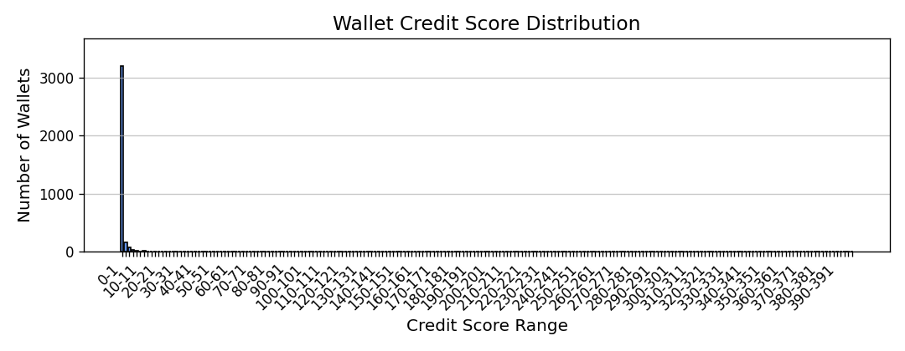

# 📊 Credit Score Analysis — Aave V2 DeFi Wallets

This document presents the **post-scoring analysis** of wallets interacting with the Aave V2 protocol. It includes credit score distribution across defined ranges and observations on user behavior patterns for both low- and high-scoring wallets.

---

## 📌 Summary Statistics

* **Total transactions analyzed**: 100,000
* **Unique wallets scored**: 3,497
* **Credit score range**: 0 – 400 (scaled from a 0–1000 range)
* **Mean score**: \~0.60
* **Median score**: 0

> 💡 Note: The majority of wallets scored between 0–5, highlighting risky or minimal protocol engagement.

---

## 📊 Score Distribution by Range (Buckets of 100)

| Score Range | Wallet Count |
| ----------- | ------------ |
| 0–100       | 3,485        |
| 101–200     | 6            |
| 201–300     | 3            |
| 301–400     | 3            |
| 401–500     | 0            |
| 501–600     | 0            |
| 601–700     | 0            |
| 701–800     | 0            |
| 801–900     | 0            |
| 901–1000    | 0            |

> 🔎 **Observation**: 99.7% of wallets fall in the 0–100 range, with very few demonstrating strong and healthy behaviors to score beyond that.

---

## 📈 Score Distribution Graph

The plot below shows a histogram of wallet scores in small buckets (width = 2) for higher granularity:

📍 **File**: `output/credit_score_distribution.png`
📍 **X-axis**: Credit score buckets
📍 **Y-axis**: Number of wallets

---

## 📉 Behavior of Wallets in the Lower Score Range (0–100)

* ✅ Mostly inactive or single-action wallets (e.g., only borrowing or only redeeming)
* ❌ High liquidation event count
* ❌ Little to no repayment after borrowing
* ⚠️ Appear bot-like or opportunistic (one-shot usage)
* 🔁 Low transaction diversity (no engagement in both lending & borrowing)

---

## 📈 Behavior of Wallets in the Higher Score Range (100–400)

* ✅ Consistently deposit before borrowing
* ✅ Show repayment responsibility
* ✅ Rare or no liquidation calls
* ✅ Participate in both deposit and borrow lifecycle
* ✅ Wallets behave more like long-term users or responsible participants

---

## 🧾 Output Artifacts

| File Path                              | Description                              |
| -------------------------------------- | ---------------------------------------- |
| `output/wallet_scores.json`            | JSON containing wallet → score mappings  |
| `output/credit_score_distribution.png` | Histogram visualizing score distribution |

---

## 📘 Conclusion

* The scoring system successfully distinguishes between highly inactive/risky wallets and a small minority of responsible, protocol-friendly wallets.
* The dataset is heavily skewed toward zero scores, suggesting bot activity or wallets exploiting flash interactions without sustainable engagement.
* Despite a capped score of 1000, **no wallet exceeded a score of 400**, indicating limited evidence of ideal long-term protocol usage in the sample.

